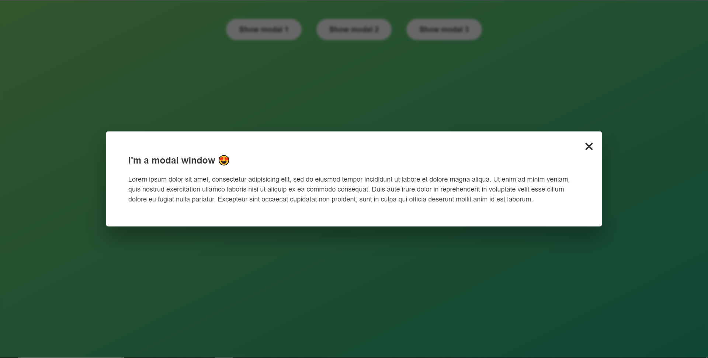

# Projektname

Show Modal

## Beschreibung

Es handelt sich um ein kleines Projekt, in dem ich gelernt habe, wie man ein Pop-up-Fenster erstellen kann, das mit dem Drücken der ESC Taste, dem Klicken des close Buttons oder einem Klick außerhalb des Fensters geschlossen werden kann.
## Vorschau

 

## Verwendete Technologien

- HTML
- CSS
- JavaScript
